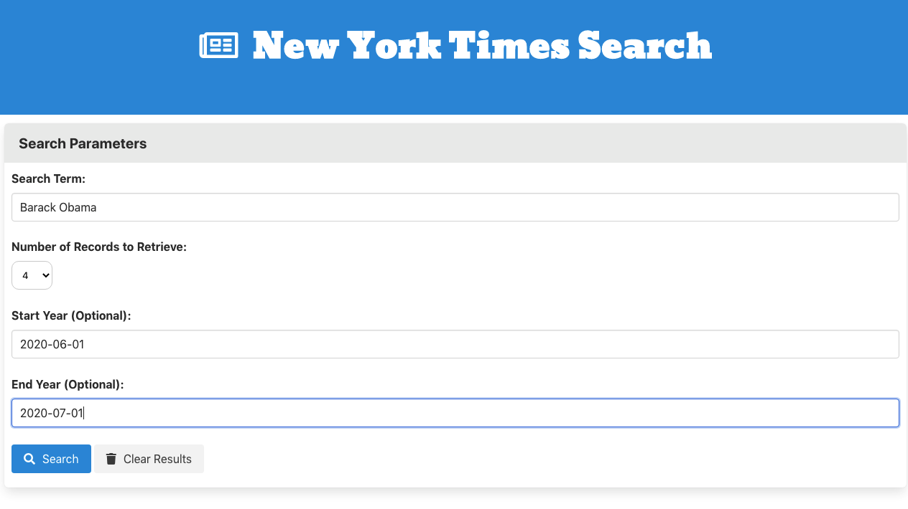

# New York Times Article Search

## Table of Contents
*  [Description](#description)
*  [User Story](#user-story)
*  [Features of the Application](#features-of-the-application)
*  [Preview of New York Times Article Search](#preview-of-new-york-times-article-search)
*  [Links](#links)
*  [Usage](#usage)
*  [Built Using](#built-using)
*  [License](#license)
*  [Questions](#questions)

## Description

Server-side APIs are an interface often used by companies to allow users a way to interact and gain access to their information. For this article search application, I used the [New York Times Article Search API](https://developer.nytimes.com/docs/articlesearch-product/1/overview) in order to retrieve data to access articles based on the user's search parameters.

The retrieved data from the New York Times Article Search API call - based on a user search term - provided the headline, byline, author, publication date and year, among other details. Using this information, I was able to sift through the JSON object, extract the relevant information to render onto the bottom of the page, and build an application - that is both dynamic and functional - that retrieves a sought number of records for the user.

## User Story
~~~
AS A user  
I WANT to search the New York Times database for articles using specific parameters  
SO THAT I can retrieve a list of articles to read.
~~~

## Features of the Application
~~~
GIVEN a New York Times article search application with form inputs  
WHEN I search for a term  
THEN I am presented with relevant articles that include the search term  
WHEN I use the search parameters, such as its start year and its end year,  
THEN I am presented with relevant articles that adhere to the search parameters.
~~~

## Preview of New York Times Article Search

The following images demonstrate the application functionality:

The following GIF demonstrates the application functionality, showcasing the application's ability to clear results and specify the number of records to retrieve:

## Links

1. [Deployed Application](https://rh9891.github.io/NewYorkTimesArticleSearch/)

2. [Github Repository](https://github.com/rh9891/NewYorkTimesArticleSearch)

## Usage

The following example of usage displays the use of the ajax call to the New York Times Article Search API to retrieve the JSON object:
~~~
var queryURL = buildQueryURL();

$.ajax({
    url: queryURL,
    method: "GET"
}).then(updatePage);
~~~

## Built Using

Listed below are the frameworks and guides that made building this article search application possible.:

* [Bulma](https://bulma.io/)
* [JQuery](https://jquery.com)
* [New York Times API Documentation](https://developer.nytimes.com/docs/articlesearch-product/1/overview)

## License

This application does not currently have any licenses.

The user is not permitted to use, modify, or share any parts of it. Though the code for this application is hosted on Github, where you are allowed to view and fork the code, this does not imply that the user is permitted to use, modify, or share the contents of this application for any purpose.

## Questions

If you have any questions, comments, or issues regarding this New York Times article search application, please don't hesitate to contact me either via [Github](https://github.com/rh9891) or via email at <romie.hecdivert@gmail.com>.